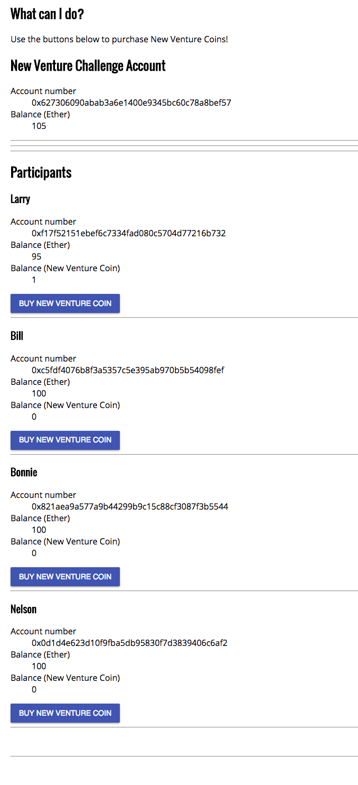

# ICO DEMO

Playing around with [truffle framework](http://truffleframework.com/) and [zeppelin smart-contracts library](https://github.com/OpenZeppelin/zeppelin-solidity) to build an Initial Coin Offering demo. Thanks to [@gustavoguimaraes](https://github.com/gustavoguimaraes) for his excellent [blog post](https://blog.zeppelin.solutions/how-to-create-token-and-initial-coin-offering-contracts-using-truffle-openzeppelin-1b7a5dae99b6) that started it all.

In order to run this web app successfully you'll have to run the following commands

```bash
cd ico-demo
truffle develop
```

In the development console, you'll also have to run the following commands

```javascript
// Deploy the smart contracts (a.k.a. apply the migrations)
migrate

// Get test account 1
account1 = web3.eth.accounts[1]

// Get NVCoinCrowdsale instance (crowdsale.address will give you the address of the wallet)
NVCoinCrowdsale.deployed().then(inst => { crowdsale = inst })

// Buy your the first coin 
crowdsale.sendTransaction({ from: account1, value: web3.toWei(5, "ether")})
```

Then you can run the web app with:

```bash
cd ico-demo
npm start 
```

You shoudl see the wallet balances reflected correctly. It will look something like this:




## Useful code snippets
Used these to play around and experiment

```javascript
// Get token address for NVCrowdsale (i.e. address for NVCoin)
crowdsale.token().then(addr => { tokenAddress = addr } )
nvCoinInstance = NVCoin.at(tokenAddress)

// Check balance in NVCoin
nvCoinInstance.balanceOf(account1).then(balance => account1NVTokenBalance = balance.toString(10))
web3.fromWei(account1NVTokenBalance, "ether")

// Check account balance in ether
nvCoinInstance.balanceOf(account1).then(balance => balance.toString(10))

// Account balance in ether
web3.fromWei(web3.eth.getBalance(account1).toString(), "ether")
```
